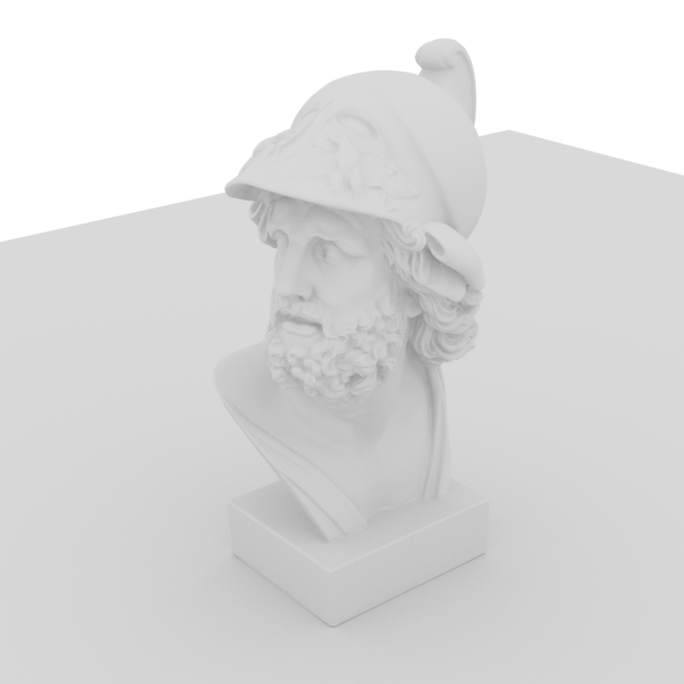

# Ajax

## Ambient Occlusion

### Ubuntu 22.04

```shell
bazel run --config=gcc11 --compilation_mode=opt //okapi/ui:okapi.ui -- \
--scene_filename=${HOME}/dev/Piper/devertexwahn/okapi/scenes/ajax/ajax.ao.okapi.xml \
--samples_per_pixel=1024
```

### Ubuntu 24.04

```shell
bazel run --config=gcc13 --compilation_mode=opt //okapi/ui:okapi.ui -- \
--scene_filename=${HOME}/dev/Piper/devertexwahn/okapi/scenes/ajax/ajax.ao.okapi.xml \
--samples_per_pixel=1024
```

### Windows

```shell
bazel --output_base=C:/bazel_output_base run --config=vs2022 --compilation_mode=opt //okapi/ui:okapi.ui -- --scene_filename=C:/dev/Piper/devertexwahn/okapi/scenes/ajax/ajax.ao.okapi.xml --samples_per_pixel=1024
```

## Simple Integrator

### macOS

```shell
bazel run --config=macos --compilation_mode=opt //okapi/ui:okapi.ui -- \
--scene_filename=${HOME}/dev/Piper/devertexwahn/okapi/scenes/ajax/ajax.simple.okapi.xml \
--samples_per_pixel=100 \
--intersector=octree
```

### Ubuntu 24.04

```shell
bazel run --config=gcc13 --compilation_mode=opt //okapi/ui:okapi.ui -- \
--scene_filename=${HOME}/dev/Piper/devertexwahn/okapi/scenes/ajax/ajax.simple.okapi.xml \
--samples_per_pixel=100 \
--intersector=octree
```

## Constant Emitter

### macOS

```shell
bazel run --config=macos --compilation_mode=opt //okapi/ui:okapi.ui -- \
--scene_filename=${HOME}/dev/Piper/devertexwahn/okapi/scenes/ajax/ajax.constant_emitter.okapi.xml \
--samples_per_pixel=100
```

### Ubuntu 24.04

```shell
bazel run --config=gcc13 --compilation_mode=opt //okapi/ui:okapi.ui -- \
--scene_filename=${HOME}/dev/Piper/devertexwahn/okapi/scenes/ajax/ajax.constant_emitter.okapi.xml \
--samples_per_pixel=1
```



Flip shows no big difference (black image);

```shell
bazel run --config=gcc13 @flip//:flip-cli --compilation_mode=opt -- -r $(pwd)/reference_images/ajax.constant_emitter.mitsuba.png -t $(pwd)/reference_images/ajax.constant_emitter.mitsuba.png -d $(pwd) --hist
```

## Sky Emitter

### macOS

```shell
bazel run --config=macos --compilation_mode=opt //okapi/ui:okapi.ui -- \
--scene_filename=${HOME}/dev/Piper/devertexwahn/okapi/scenes/ajax/ajax.sky_emitter.okapi.xml \
--samples_per_pixel=100
```

### Ubuntu 24.04

```shell
bazel run --config=gcc13 --compilation_mode=opt //okapi/ui:okapi.ui -- \
--scene_filename=${HOME}/dev/OkapiRT/devertexwahn/okapi/scenes/ajax/ajax.normal.okapi.xml \
--samples_per_pixel=100
```

### Windows

```shell
bazel --output_base=C:/bazel_output_base run --config=vs2022 --compilation_mode=opt //okapi/ui:okapi.ui -- --scene_filename=C:/dev/Piper/devertexwahn/okapi/scenes/ajax/ajax.sky_emitter.okapi.xml --samples_per_pixel=1024
```
