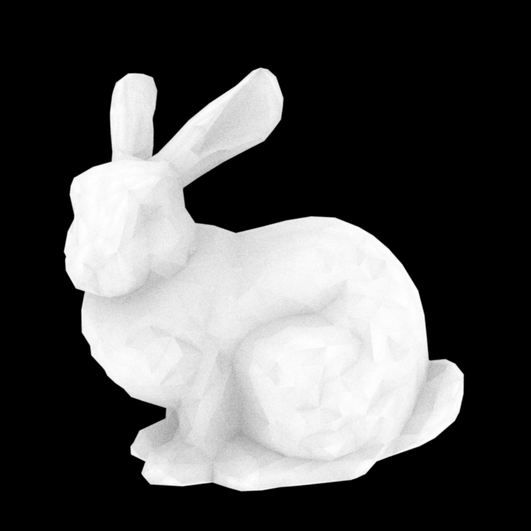

# Stanford Bunny

http://graphics.stanford.edu/data/3Dscanrep/



#### UI

*macOS*

```shell
bazel run --config=macos --compilation_mode=opt //okapi/ui:okapi.ui -- \
--scene_filename=${HOME}/dev/Piper/devertexwahn/okapi/scenes/bunny/bunny.normal.okapi.xml \
--samples_per_pixel=100
```

```shell
bazel run --config=macos --compilation_mode=opt //okapi/ui:okapi.ui -- \
--scene_filename=${HOME}/dev/Piper/devertexwahn/okapi/scenes/bunny/bunny.ao.okapi.xml \
--samples_per_pixel=100
```

```shell
bazel run --config=macos --compilation_mode=opt //okapi/ui:okapi.ui -- \
--scene_filename=${HOME}/dev/Piper/devertexwahn/okapi/scenes/bunny/bunny.hit.okapi.xml \
--samples_per_pixel=100
```

```shell
bazel run --config=macos --compilation_mode=opt //okapi/ui:okapi.ui -- \
--scene_filename=/Users/vertexwahn/dev/Piper/devertexwahn/okapi/scenes/bunny/bunny.hit.okapi.xml \
--samples_per_pixel=100
```

*Ubuntu 22.04*

```shell
bazel run --config=gcc11 --compilation_mode=opt //okapi/ui:okapi.ui -- \
--scene_filename=${HOME}/dev/Piper/devertexwahn/okapi/scenes/bunny/bunny.ao.okapi.xml \
--samples_per_pixel=100
```

*Ubuntu 24.04*

```shell
bazel run --config=gcc13 --compilation_mode=opt //okapi/ui:okapi.ui -- \
--scene_filename=${HOME}/dev/Piper/devertexwahn/okapi/scenes/bunny/bunny.ao.okapi.xml \
--samples_per_pixel=100
```
