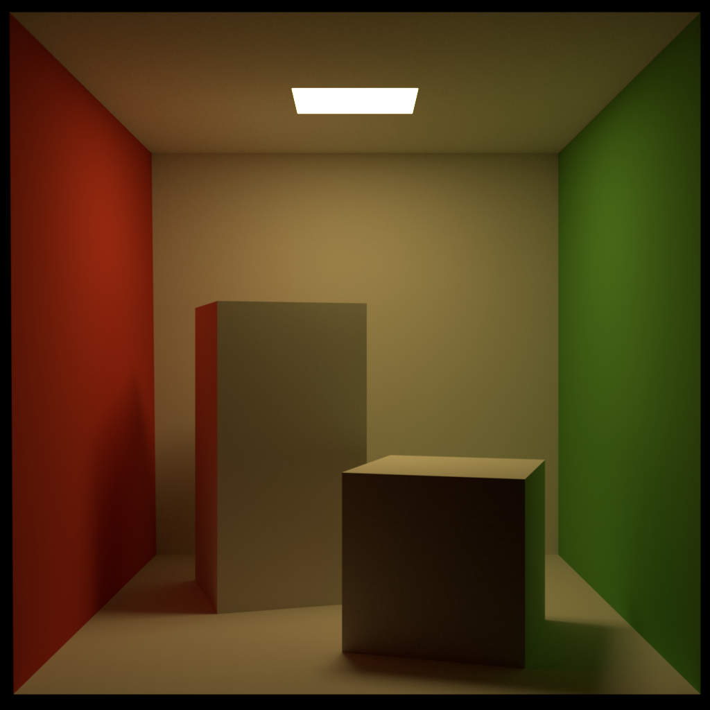
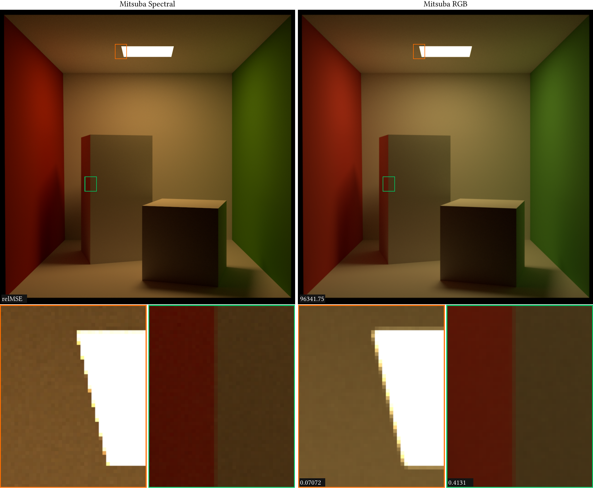
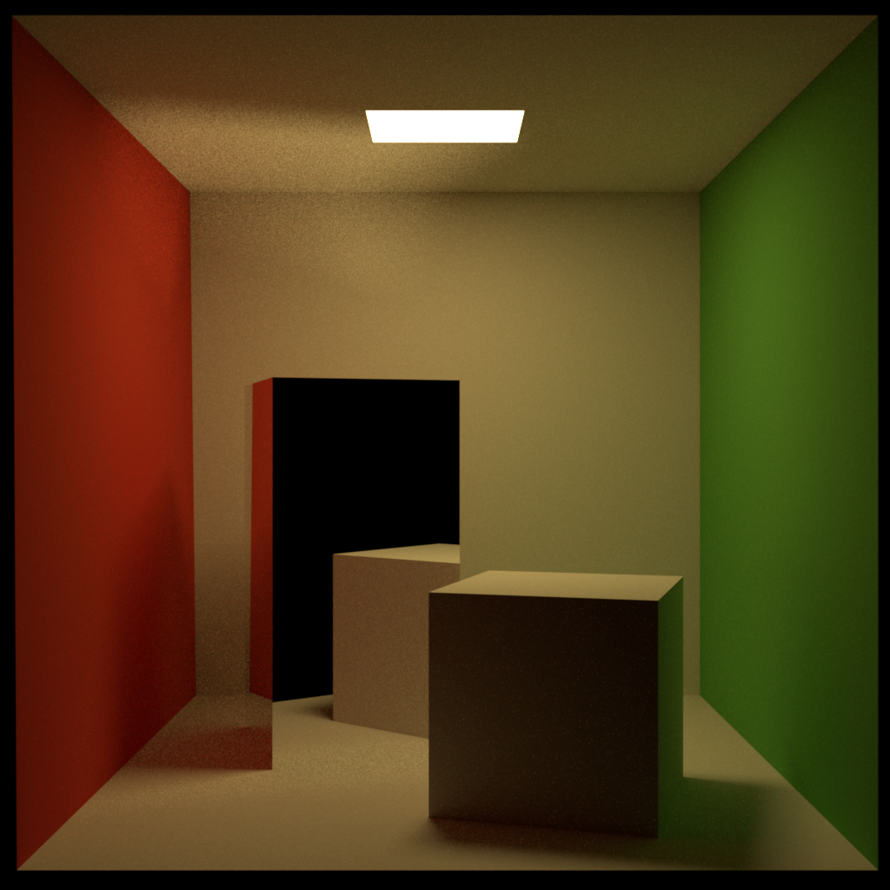

# The Cornell Box

## Introduction

Here is a test rendering of the Cornell Box using [Okapi Renderer](https://vertexwahn.de/page/okapi/) with a naive diffuse path tracing integrator
(hence the noise even though the image was rendered with 8192 spp):


The Cornell Box data can be found at the [The Cornell Box](https://www.graphics.cornell.edu/online/box/) website provided by the Cornell University.
There is also a [file sharing service](https://it.cornell.edu/box/log-cornell-box) provided by the Cornell University which is also called Cornell Box.
I am not sure if this is deliberate and if the file service does know about its legacy.

The Cornell Box Data provided in the [data section](https://www.graphics.cornell.edu/online/box/data.html) consists of a cubic box that has one open side.
Inside the box, there is a tall and a short block.
The tall block is left.
The short block is right.
All surfaces are assumed to be Lambertian.
Note that there are also a lot of other variants of the Cornell Box and a few of them are mentioned in the [History](https://www.graphics.cornell.edu/online/box/history.html) section.
The Data section provides for the material and light information measured wavelength data.
No RGB color data is provided.
From the spectral measured data RGB values can be derived.
Anyway, different variants are using different RGB color values.
The following table gives an impression of which RGB values can be found in the wild.

<table>
    <tr>
        <th>Renderer</th>
        <th></th>
        <th>Floor</th>
        <th>Light</th>
        <th>Ceiling</th>
        <th>Back wall</th>
        <th>Right wall</th>
        <th>Left wall</th>
        <th>Short block</th>
        <th>Tall block</th>
    </tr>
    <tr>
        <td rowspan="3"><a href="https://benedikt-bitterli.me/resources/">Tungsten</a></td>
        <td>R</td>
        <td>0.725</td>
        <td>17</td>
        <td>0.725</td>
        <td>0.725</td>
        <td>0.14</td>
        <td>0.63</td>
        <td>0.725</td>
        <td>0.725</td>
    </tr>
    <tr>
        <td>G</td>
        <td>0.71</td>
        <td>12</td>
        <td>0.71</td>
        <td>0.71</td>
        <td>0.45</td>
        <td>0.065</td>
        <td>0.71</td>
        <td>0.71</td>
    </tr>
    <tr>
        <td>B</td>
        <td>0.68</td>
        <td>4</td>
        <td>0.68</td>
        <td>0.68</td>
        <td>0.091</td>
        <td>0.05</td>
        <td>0.68</td>
        <td>0.68</td>
    </tr>
    <tr>
        <td rowspan="3"><a href="https://github.com/mitsuba-renderer/mitsuba-data/blob/4c6851086ec05b401b217836e146e8213dc687b2/scenes/cbox/fragments/bsdfs-rgb.xml#L4">Mitsuba</a></td>
        <td>R</td>
        <td>0.885809</td>
        <td>18.387</td>
        <td>0.885809</td>
        <td>0.885809</td>
        <td>0.105421</td>
        <td>0.570068</td>
        <td>0.45</td>
        <td>0.45</td>
    </tr>
    <tr>
        <td>G</td>
        <td>0.698859</td>
        <td>10.9873</td>
        <td>0.698859</td>
        <td>0.698859</td>
        <td>0.37798</td>
        <td>0.0430135</td>
        <td>0.30</td>
        <td>0.30</td>
    </tr>
    <tr>
        <td>B</td>
        <td>0.666422</td>
        <td>2.75357</td>
        <td>0.666422</td>
        <td>0.666422</td>
        <td>0.076425</td>
        <td>0.0443706</td>
        <td>0.90</td>
        <td>0.90</td>
    </tr>
    <tr>
        <td rowspan="3"><a href="https://github.com/Vertexwahn/Piper/blob/main/third_party/nori-3df2370db5b51c558be3d7e65b8c26c6dfe7df68/scenes/pa4/cbox/cbox-whitted.xml">Nori</a></td>
        <td>R</td>
        <td>0.725</td>
        <td>40</td>
        <td>0.725</td>
        <td>0.725</td>
        <td>0.161</td>
        <td>0.630</td>
        <td>0.725</td>
        <td>0.725</td>
    </tr>
    <tr>
        <td>G</td>
        <td>0.71</td>
        <td>40</td>
        <td>0.71</td>
        <td>0.71</td>
        <td>0.133</td>
        <td>0.065</td>
        <td>0.71</td>
        <td>0.71</td>
    </tr>
    <tr>
        <td>B</td>
        <td>0.68</td>
        <td>40</td>
        <td>0.68</td>
        <td>0.68</td>
        <td>0.427</td>
        <td>0.05</td>
        <td>0.68</td>
        <td>0.68</td>
    </tr>
</table>

For the rendering from above the RGB colors from Tungsten have been used.

What are your favorite RGB colors for the classic Cornell Box scene?

## Render Cornell Box using Okapi

### Cornell Box

#### UI

*macOS*

```shell
bazel run --config=macos --compilation_mode=opt //okapi/ui:okapi.ui -- \
--scene_filename=${HOME}/dev/Piper/devertexwahn/okapi/scenes/cornell_box/cornell_box.naive.diffuse.okapi.xml \
--samples_per_pixel=1 \
--integrator=next \
--film_filename=cornell_box.naive_diffuse.spp1.next.exr
```

With denoising:

```shell
bazel run --config=macos --compilation_mode=opt //okapi/ui:okapi.ui -- \
--scene_filename=${HOME}/dev/Piper/devertexwahn/okapi/scenes/cornell_box/cornell_box.naive.diffuse.box_filter.okapi.xml \
--samples_per_pixel=100 \
--integrator=next \
--film_filename=cornell_box.naive.diffuse.box_filter.spp100.next.exr
```

*Ubuntu 22.04*

```shell
bazel run --config=gcc11 --compilation_mode=opt //okapi/ui:okapi.ui -- \
--scene_filename=${HOME}/dev/Piper/devertexwahn/okapi/scenes/cornell_box/cornell_box.naive.diffuse.okapi.xml \
--samples_per_pixel=1
```

With denoising:

```shell
bazel run --config=gcc11 --compilation_mode=opt //okapi/ui:okapi.ui -- \
--scene_filename=${HOME}/dev/Piper/devertexwahn/okapi/scenes/cornell_box/cornell_box.naive.diffuse.box_filter.okapi.xml \
--samples_per_pixel=100 \
--integrator=next \
--film_filename=cornell_box.naive.diffuse.box_filter.spp100.next.exr
```

#### CLI

*Ubuntu 22.04*

Individual renderings:

```shell
bazel run --config=gcc11 --compilation_mode=opt //okapi/cli:okapi.cli -- \
--scene_filename=${HOME}/dev/Piper/devertexwahn/okapi/scenes/cornell_box/cornell_box.naive.diffuse.okapi.xml \
--samples_per_pixel=1 \
--intersector=brute_force \
--film_filename=cornell_box.naive_diffuse.spp1.brute_force.exr

bazel run --config=gcc11 --compilation_mode=opt //okapi/cli:okapi.cli -- \
--scene_filename=${HOME}/dev/Piper/devertexwahn/okapi/scenes/cornell_box/cornell_box.naive.diffuse.okapi.ci.xml
```

Render Cornell Box

```shell
spp_list=(1 2 4 8 16 32 64 128 256 512 1024 2048 4096 8192 16384 32768 65536)
#name=(1 2 4 8 16 32 64 128 256 512 1024 2048 4k 4k 16k 32k 65k)

for spp in "${spp_list[@]}"
do
  echo "$spp"
  
  bazel run --config=gcc11 --compilation_mode=opt //okapi/cli:okapi.cli -- \
    --scene_filename=${HOME}/dev/Piper/devertexwahn/okapi/scenes/cornell_box/cornell_box.naive.diffuse.okapi.xml \
    --samples_per_pixel="$spp" \
    --intersector=brute_force \
    --film_filename=cornell_box.naive_diffuse.spp"$spp".brute_force.exr
  
  bazel run --config=gcc11 --compilation_mode=opt //okapi/cli:okapi.cli -- \
    --scene_filename=${HOME}/dev/Piper/devertexwahn/okapi/scenes/cornell_box/cornell_box.naive.diffuse.okapi.xml \
    --samples_per_pixel="$spp" \
    --film_filename=cornell_box.naive_diffuse.spp"$spp".embree.exr
    
  bazel run --config=gcc11 --compilation_mode=opt //okapi/cli:okapi.cli -- \
    --scene_filename=${HOME}/dev/Piper/devertexwahn/okapi/scenes/cornell_box/cornell_box.naive.diffuse.okapi.xml \
    --samples_per_pixel="$spp" \
    --intersector=octree \
    --film_filename=cornell_box.naive_diffuse.spp"$spp".octree.exr
done
```

*Ubuntu 24.04*

Individual renderings:

```shell
bazel run --config=gcc13 --compilation_mode=opt //okapi/cli:okapi.cli -- \
--scene_filename=${HOME}/dev/Piper/devertexwahn/okapi/scenes/cornell_box/cornell_box.naive.diffuse.okapi.xml \
--samples_per_pixel=1 \
--intersector=brute_force \
--film_filename=cornell_box.naive_diffuse.spp1.brute_force.exr
```

```shell
bazel run --config=gcc13 --compilation_mode=opt //okapi/cli:okapi.cli -- \
--scene_filename=${HOME}/dev/Piper/devertexwahn/okapi/scenes/cornell_box/cornell_box.naive.diffuse.okapi.ci.xml
```

## Render Cornell Box using Mitsuba

```shell
python3 mitsuba_reference.py
```



### Spectral rendering vs. RGB rendering



## Generate PDF Figure

```shell
python3 imagegen.py
python3 imagegen2.py
```

## Mirror BSDF

There is also a version of the Cornell Box where the large box is a perfect mirror:



The above images has been rendered using Mitsuba 3 - the perfect mirror bsdf looks like this in the file format:

```xml
	<shape type="obj">
		<string name="filename" value="meshes/cbox_largebox.obj"/>

		<bsdf type="conductor">
			<string name="material" value="none"/>
		</bsdf>
	</shape>
```

## Further References

- [SketchUp Cornell Box tutorial - part 1](http://docs.eclat-digital.com/ocean2020-docs/tutorials/sketchup-cornellbox-part1/index.html)
- [Cornell box images](http://graphics.ucsd.edu/~henrik/images/cbox.html)
