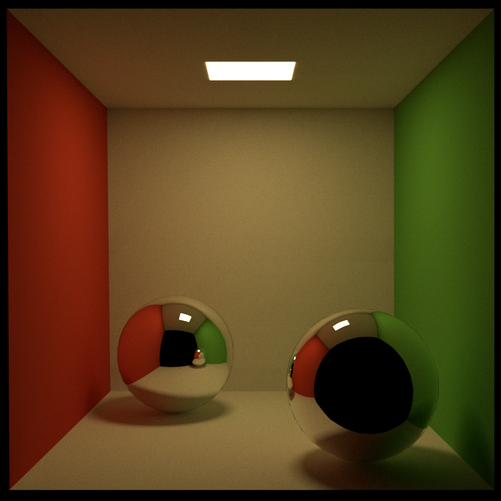
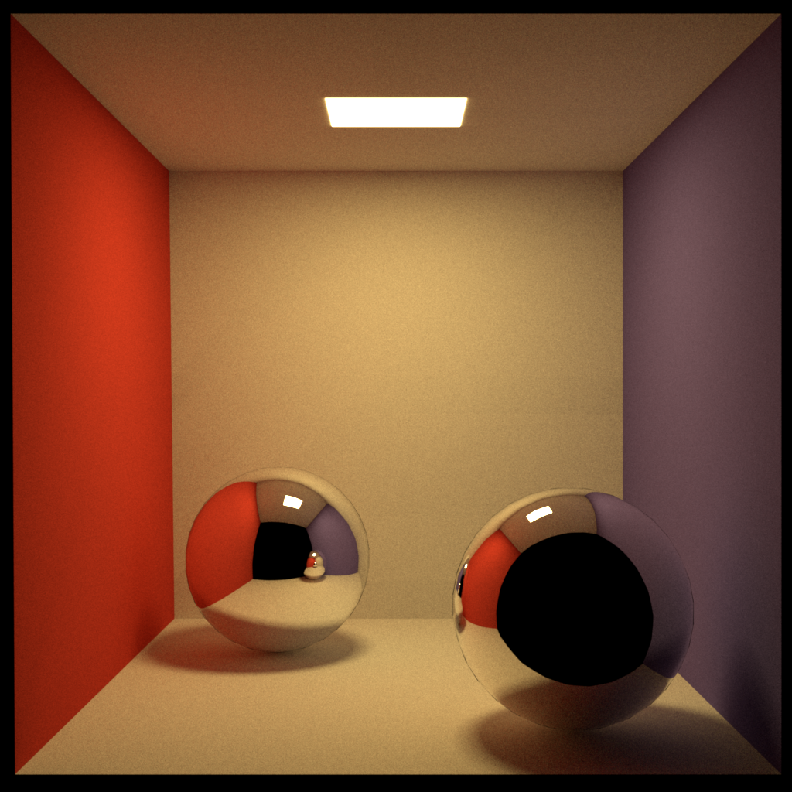
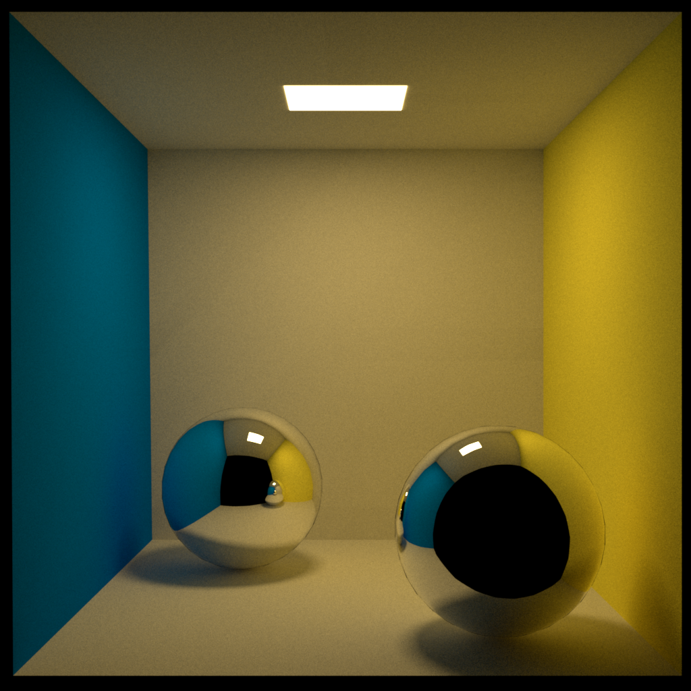
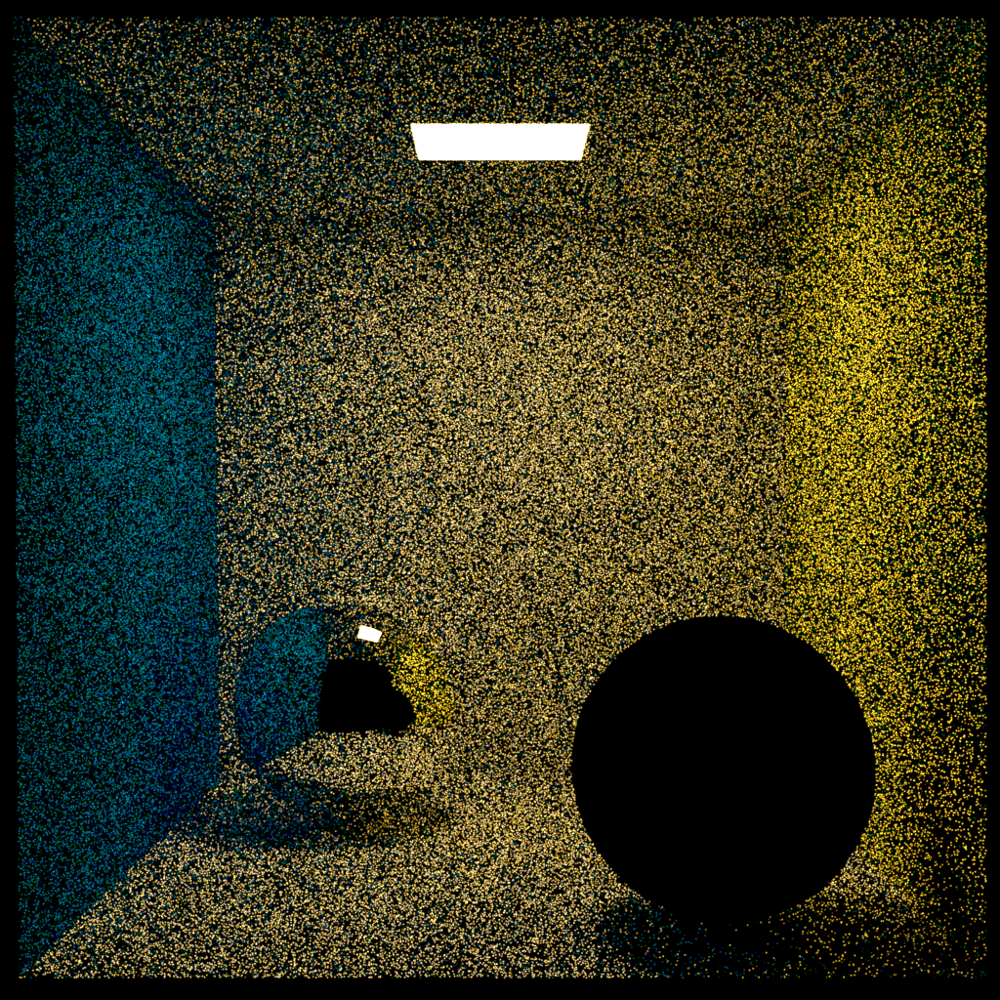
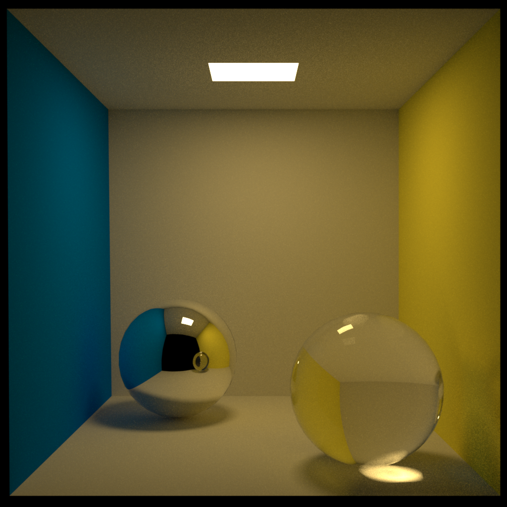

# Cornell Box with Spheres



```shell
bazel run --config=gcc13 --compilation_mode=opt //okapi/ui:okapi.ui -- \
--scene_filename=${HOME}/dev/Piper/devertexwahn/okapi/scenes/cornell_box_with_spheres/cornell_box_with_spheres.next.okapi.xml \
--samples_per_pixel=8192 \
--film_filename=cornell_box_with_spheres.next.exr
```

## Variant 2:



```shell
bazel run --config=gcc13 --compilation_mode=opt //okapi/ui:okapi.ui -- \
--scene_filename=${HOME}/dev/Piper/devertexwahn/okapi/scenes/cornell_box_with_spheres/cornell_box_with_spheres.next.okapi_v2.xml \
--samples_per_pixel=8192 \
--film_filename=cornell_box_with_spheres_v2.next.exr
```

## Variant 3:



```shell
bazel run --config=gcc13 --compilation_mode=opt //okapi/ui:okapi.ui -- \
--scene_filename=${HOME}/dev/Piper/devertexwahn/okapi/scenes/cornell_box_with_spheres/cornell_box_with_spheres.next.okapi_v3.xml \
--samples_per_pixel=8192 \
--film_filename=cornell_box_with_spheres_v3.next.exr \
--thread_count=6
```

## Variant 4 (mirror + smooth dielectric material):



```shell
bazel run --config=gcc13 --compilation_mode=opt //okapi/ui:okapi.ui -- \
--scene_filename=${HOME}/dev/Piper/devertexwahn/okapi/scenes/cornell_box_with_spheres/cornell_box_with_spheres.next.okapi_v4.xml \
--samples_per_pixel=8192 \
--film_filename=cornell_box_with_spheres_v4.next.exr
```

Reference rendering with Mitsuba:

```shell
python3 mitsuba_reference_v4.py
```

